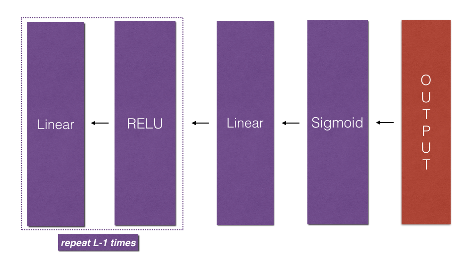

# Building A Deep Neural Net

**Notation**:
- Superscript[l] denotes a quantity associated with the l - th layer.
    - _Example_: `a ^ [L]` is the L - th layer activation. `W ^ [L]` and `b ^ [L]` are the L - th layer parameters.


- Superscript(i) denotes a quantity associated with the i - th example.
    - _Example_: `x ^ (i)` is the i - th training example.


- Lowerscript i denotes the i - th entry of a vector.
    - _Example_: `a ^ [l]_i` denotes the i - th entry of the l - th layer's activations).


## 1-Packages ##

```py

import numpy as np
import h5py
import matplotlib.pyplot as plt

```

## 2-Outline ##

1. Initialize the parameters for an L - layer Neural Network.
2. Implement the forward propagation module.
    - Complete a linear part of the layer's activation. This will result in ` Z ^ [l] `
    - Go from [LINEAR -> ACTIVATION] by using an activation function. This will result in ` A ^ [l] `
    - Stack together the[LINEAR -> ReLU] function L - 1 times and put a[LINEAR -> SIGMOID] at the end(since we are doing binary classification).
3. Compute the loss.
4. Implement the backward propagation.
    - Complete the LINEAR part of the layer's back prop. step.
    - Use the gradient of the ACTIVATE function to calculate the gradients.
    - Make a[LINEAR -> ACTIVATION] back function using the gradient of the sigmoid or the ReLU function.
    - Stack L - 1 [LINEAR -> RELU] functions and add a[LINEAR -> SIGMOID] function at the start.
5. update the parameters.


<caption> <center> **Figure 1**</center> </caption> <br>


## 3-Initialization ##

Write a helper function to initialize the parameters for L layers.

The initialization for a deeper L - layer neural network is more complicated because there are many more weight matrices and bias vectors.

Make sure that your dimensions match between each layer. Recall that ` n ^ [l] ` is the number of units in layer l. Thus for example if the size of our input X is (12288, 209)(with m = 209 examples) then:

<table style="width:100%">

   <tr>
        <td> </td>
        <td> **Shape of W ** </td>
        <td> **Shape of b ** </td>
        <td> **Activation ** </td>
        <td> **Shape of Activation ** </td>
   </tr>

   <tr>
        <td> **Layer 1 ** </td>
        <td> (n ^ [1], 12288) </td >
        <td> (n ^ [1], 1) </td>
        <td> Z ^ [1]=W ^ [1]  X + b ^ [1] </td>
        <td> (n ^ [1], 209) </td>
   </tr>

   <tr>
        <td> **Layer 2 ** </td >
        <td> (n ^ [2], n ^ [1]) </td>
        <td> (n ^ [2], 1) </td>
        <td> Z ^ [2]=W ^ [2] A ^ [1] + b ^ [2] </td>
        <td> (n ^ [2], 209) </td>
   </tr>

   <tr>
        <td> ... </td>
        <td> ... </td>
        <td> ... </td>
        <td> ... </td>
        <td> ... </td>
   <tr/>

   <tr>
        <td> **Layer L - 1 ** </td>
        <td> (n ^ [L - 1], n ^ [L - 2]) </td>
        <td> (n ^ [L - 1], 1) </td>
        <td> Z ^ [L - 1]=W ^ [L - 1] A ^ [L - 2] + b ^ [L - 1] </td>
        <td> (n ^ [L - 1], 209) </td>
    </tr>


   <tr>
        <td> **Layer L ** </td>
        <td> (n ^ [L], n ^ [L - 1]) </td>
        <td> (n ^ [L], 1) </td>
        <td> Z ^ [L]=W ^ [L] A ^ [L - 1] + b ^ [L] </td>
        <td> (n ^ [L], 209) </td>
   </tr>


</table>


#### Implementing it:

```py

def initialize_parameters_deep(layer_dims):
    """
    Initialize the parameters for the L layer deep Neural Network

    Arguments:
    layer_dims -- python array (list) containing the dimensions of each layer in our network

    Returns:
    parameters -- python dictionary containing parameters "W1", "b1", "W2", ... "WL", "bL"
        Wl -- weight matrix of shape (layer_dims[l], layer_dims[l-1])
        bl -- bias vector of shape (layer_dims[l], 1)
    """

    parameters = {}  # create an empty dictionary of parameters
    L = len(layer_dims)  # the size of the Neural network

    for l in range(1, L):
        parameters["W" + str(l)] = np.random.randn( layer_dims[l], layer_dims[l-1] ) * 0.01
        parameters["b" +str(l)] = np.zeros( layer_dims[l], 1 ) * 0.01

        assert( parameters["W" + srt(l)].shape == ( layer_dims[l], layer_dims[l-1] ) )
        assert( parameters["b" + str(l)].shape == ( layer_dims[l], 1 ) )

    return parameters

```

## 4-Forward Propagation Module ##

### 4.1-Linear Forward ###

```py

def linear_forward(A, W, b):
    """
    Implement the linear part of the layer's forward propagation

    Arguments:
    A -- Activations from the previous layer (or the input data): (size of previous layer, number of examples)
    W -- Weights matrix: numpy array of shape (size of current layer, size of previous layer)
    b -- bias vector: numpy array of shape (size of current layer, 1)

    Returns:
    Z -- input of the activation function (aka. pre-activation)
    cache -- python dictionary containing "A", "W" and "b"; stored for computing backward pass effectively.  
    """

    # calculating the pre-activataion
    Z = np.dot(W, A) + b

    assert( Z.shape == (W.shape[0], A.shape[1]) )

    cache = (A, W, b)

    return Z, cache

```

## 4.2-Linear Activation Forward ##

We will use two activation functions:

- **Sigmoid**: `sigma(Z) = sigma(W A + b) = 1 / { 1 + e^-(W A + b)}`. This function returns **two** items: the activation value "a" and a "cache" that contains "Z" (it's what we will feed in to the corresponding backward function). To use it you could just call: 
``` python
A, activation_cache = sigmoid(Z)
```

- **ReLU**: The mathematical formula for ReLu is `A = RELU(Z) = max(0, Z)`. This function returns **two** items: the activation value "A" and a "cache" that contains "Z" (it's what we will feed in to the corresponding backward function). To use it you could just call:
``` python
A, activation_cache = relu(Z)
```

```py

def linear_activation_forward(A_prev, W, b, activation):
    """
    Implement the forward propagation for the LINEAR->ACTIVATION layer

    Arguments:
    A_prev -- activations from the previous layer (or input data): (size of previous layer, number of examples)
    W -- weights matrix: numpy array of shape (size of current layer, size of previous layer)
    b -- bias vector: numpy array of shape (size of current layer, 1)
    activation -- the activation to be used in this layer, stored as a text string: 'sigmoid' or 'relu'

    Returns:
    A -- the output of the activation function, also called the post activation value
    cache -- a python dictionary containg the 'linear_cache' and 'activation_cache'; stored to compute backward pass effectively
    """

    if activation == 'sigmoid':
        Z, linear_cache = linear_forward(A_prev, W, b)
        A, activation_cache = sigmoid(Z)

    elif activation == 'relu':
        Z, linear_cache = linear_forward(A_prev, W, b)
        A, activation_cache = relu(Z)

    assert (A.shape == (W.shape[0], A_prev.shape[1]))
    cache = (linear_cache, activation_cache)

    return A, cache

```

For an L-layer model, we will need a function to replicate the linear_activation_forward function L-1 times with ReLU and 1 times with Sigmoid


<caption><center> **Figure 2** : [LINEAR -> RELU] * (L-1) -> LINEAR -> SIGMOID model</center></caption><br>

In the code below, the variable AL will denote `A[L] = sigmoid(Z[L]) = sigmoid(W[L]A[L−1] + b[L])`. This is sometimes also called Yhat.

```py

def L_model_forward(X, parameters):
    """
    Implement forward propagation for [LINEAR->RELU]*(L-1)->[LINEAR->SIGMOID] computation.

    Arguments:
    X -- data, numpy array of shape (input size, number of examples)
    parameters -- output of initialize_parameters_deep()

    Returns:
    AL -- last post-activation value
    caches -- list of caches containing:
                every cache of linear_activation_forward() (there are L-1 of them, indexed from 0 to L-1)
    """

    caches = []
    A = X
    L = len(parameters) // 2  # number of layers in the network

    # implement LINEAR->RELU L-1 times
    # add cache to caches
    for l in range(L-1):
        A_prev = A
        A, cache = linear_activation_forward(A_prev, parameters['W' + str(l)], parameters['b' + str(l)], 'relu')
        caches.append(cache)

    # implement LINEAR->SIGMOID
    # add cache to caches
    AL, cache = linear_activation_forward(A, parameters['W' + str(L)], parameters['b' + str(L)], 'sigmoid')
    caches.append(cache)

    assert(AL.shape == (1, X.shape[1]))

    return AL, caches

```

## 5-Cost Function ##

Now we compute the costs to check if the model is really learning.

To calculate the cross entropy cost J, we use the formula:

```py
(-1/m) * summation(i = 1 to m){
    ( y^(i)*log( a^[L](i) ) ) + ( (1-y^(i))*log( 1-a^[L](i) ) ) 
} 
```

```py

def compute_cost(AL, Y):
    """
    Implement the cost function defined by the above equtaion

    Arguments:
    AL -- post activation value from the last layer.
          This is ALSO the probability vector corresponding to the labeled predictions, shape (1, number of examples)
    Y -- true 'label' vector (for example, containing 0 if non cat, 1 if cat), shape (1, number of examples)

    Returns:
    cost -- cross entropy cost
    """

    m = Y.shape[1]

    # compute loss from aL and y
    cost = (-1/m) * np.sum( (Y*np.log(AL) + (1-Y)*np.log(1-AL)), axis= 1, keepdims= True)

    cost = np.squeeze(cost)  # To make sure your cost's shape is what we expect (e.g. this turns [[17]] into 17).
    assert (cost.shape == () )

    return cost

```

## 6 - Backward propagation module ##

Just like with forward propagation, you will implement helper functions for backpropagation. Remember that back propagation is used to calculate the gradient of the loss function with respect to the parameters. 

**Reminder**: 

<caption><center> **Figure 3** : Forward and Backward propagation for *LINEAR->RELU->LINEAR->SIGMOID* <br> *The purple blocks represent the forward propagation, and the red blocks represent the backward propagation.*  </center></caption>

The back propagation module will be built in three steps:

1. LINEAR backward
2. LINEAR->ACTIVATION backward, where the activation calculates the derivative of the activation function.
3. [LINEAR->RELU] * (L-1) -> LINEAR -> SIGMOID backward.


### 6.1-Linear Backward ###

For layer l, the linear part is:
` Z^[l] = W^[l] * A^[l-1] + b^[l] `

Suppose we have already calculated ` dZ^[l] ` i.e. (dLoss)/(dZ^[l]). We want to get ` dW^[l] `, ` db^[l] ` and ` dA^[l-1] `


<caption><center> **Figure 4** </center></caption>

The three outputs are computed using the input ` dZ^[l] `.

The formulae we use are:

1. dW[l] = (dLoss)/(dW[l]) = (1/m) * dZ[l] A[l-1].T
2. db[l] = (dLoss)/(db[l]) = (1/m) * sum( i=1 to m ){ dZ[l]i }
3. dA[l-1] = (dLoss)/(dA[l-1]) = W[l].T dZ[l]

```py

def linear_backward(dZ, cache):
    """
    Implement the linear portion of the backward propagation for a single layer.

    Arguments:
    dZ -- gradient of the cost with respect to the linear output (of current layer l)
    cache -- tuple of values (A_prev, W, b) coming from the forward propagation in the current layer.

    Returns:
    dA_prev -- gradient of the cost with respect to the activation (of the previous layer l-1), same shape as A_prev
    dW -- gradient of the cost with respect to W (current layer l), same shape as W
    db -- gradient of the cost with respect to b (current layer l), same shape as b
    """

    A_prev, W, b = cache
    m = A_prev.shape[1]

    dW = (1/m) * np.dot( dZ, A_prev.T )
    db = (1/m) * np.sum( dZ, axis=1, keepdims=True )
    dA_prev = np.dot( W.T, dZ )

    assert( dW.shape == W.shape )
    assert( db.shape == b.shape )
    assert( dA_prev.shape == A_prev.shape )

    return dA_prev, dW, db

```

### 6.2-Linear Activation Backward ###

Now we create a function that will merge the two helper functions: linear_backward and the backward step for the activation.

To implement linear_activation_backward, two backward functions are provided:

1. sigmoid_backward: Implements the back prop for the sigmoid function.
` dZ = sigmoid_backward(dA, activation_cache) `

2. relu_backward: Implements the back prop for the relu function.
` dZ = relu_backward(dA, activation_cache) `


If g(x) is the activation function, g(x)_backward compute:

` dZ[l] = dA[l] * gDash( Z[l] ) `


```py

def linear_activation_backward(dA, cache, activation):
    """
    Implement the backward propagation for the LINEAR->ACTICATION layer.

    Arguments:
    dA -- post activation gradient for the current layer
    cache -- tuple of values (linear_cache, activation_cache) we store for computing back prop efficiently
    activation -- the activation to be used in this layer, stored as a text string: "sigmoid" or "relu"

    Returns:

    """

    linear_cache, activation_cache = caches

    if activation == 'relu':
        dZ = relu_backward(dA, activation_cache)
        dA_prev, dW, db = linear_backward(dZ, linear_cache)

    elif activation == 'sigmoid':
        dZ = sigmoid_backward(dA, activation_cache)
        dA_prev, dW, db = linear_backward(dZ, linear_cache)

    return dA_prev, dW, db

```


### 6.3 - L-Model Backward ###


<caption><center>  **Figure 5** : Backward pass  </center></caption>

** Initializing backpropagation**:
To backpropagate through this network, we know that the output is, 
`A^[L] = sigma(Z^[L])`. Our code thus needs to compute `dAL` i.e. (dLoss)/(dAL)

```py
dAL = - (np.divide(Y, AL) - np.divide(1 - Y, 1 - AL)) # derivative of cost with respect to AL
```

You can then use this post-activation gradient `dAL` to keep going backward. As seen in Figure 5, you can now feed in `dAL` into the LINEAR->SIGMOID backward function you implemented (which will use the cached values stored by the L_model_forward function). After that, you will have to use a `for` loop to iterate through all the other layers using the LINEAR->RELU backward function. You should store each dA, dW, and db in the grads dictionary. To do so, use this formula : 

grads["dW" + str(l)] = dW^[l]


```py

def L_model_backward(AL, Y, caches):
    """
    Implement the backward propagation for the [LINEAR->RELU] * (L-1) -> LINEAR -> SIGMOID group
    
    Arguments:
    AL -- probability vector, output of the forward propagation (L_model_forward())
    Y -- true "label" vector (containing 0 if non-cat, 1 if cat)
    caches -- list of caches containing:
                every cache of linear_activation_forward() with "relu" (it's caches[l], for l in range(L-1) i.e l = 0...L-2)
                the cache of linear_activation_forward() with "sigmoid" (it's caches[L-1])
    
    Returns:
    grads -- A dictionary with the gradients
             grads["dA" + str(l)] = ... 
             grads["dW" + str(l)] = ...
             grads["db" + str(l)] = ... 
    """

    grads = {}
    L = len(caches)  # number of layers
    m = AL.shape[1]
    Y = Y.reshape(AL.shape)  # after this line, Y is as the same shape as AL

    dAL = - (np.divide(Y, AL) - np.divide(1 - Y, 1 - AL)) # derivative of cost with respect to AL

    # Lth layer (SIGMOID -> LINEAR) gradients. Inputs: "dAL, current_cache". Outputs: "grads["dAL-1"], grads["dWL"],
    current_cache = caches[L-1]
    grads["dA" + str(L-1)], grads["dW" + str(L)], grads["db" + str(L)] = linear_activation_backward(dAL, current_cache, "sigmoid")
    
    # Loop from l=L-2 to l=0
    for l in reversed(range(L-1)):
        # lth layer: (RELU -> LINEAR) gradients.
        # Inputs: "grads["dA" + str(l + 1)], current_cache". Outputs: "grads["dA" + str(l)] , grads["dW" + str(l + 1)] , grads["db" + str(l + 1)] 
        current_cache = caches[l]
        dA_prev_temp, dW_temp, db_temp = linear_activation_backward(grads["dA" + str(l+1)], current_cache, "relu")
        grads["dA" + str(l)] = dA_prev_temp
        grads["dW" + str(l + 1)] = dW_temp
        grads["db" + str(l + 1)] = db_temp

    return grads

```

### 6.4-Update Parameters ###

```py

def update_parameters(parameters, grads, learning_rate):
    """
    Update parameters using gradient descent
    
    Arguments:
    parameters -- python dictionary containing your parameters 
    grads -- python dictionary containing your gradients, output of L_model_backward
    
    Returns:
    parameters -- python dictionary containing your updated parameters 
                  parameters["W" + str(l)] = ... 
                  parameters["b" + str(l)] = ...
    """
    
    L = len(parameters) // 2 # number of layers in the neural network

    # Update rule for each parameter. Use a for loop.
    for l in range(L):
        parameters["W" + str(l+1)] = parameters["W" + str(l+1)] - learning_rate*grads["dW" + str(l+1)]
        parameters["b" + str(l+1)] = parameters["b" + str(l+1)] - learning_rate*grads["db" + str(l+1)]
    
    return parameters

```

